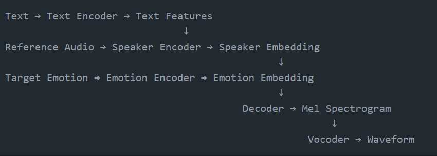

# Speech-Project-AI-Voice-Cloning

Complete Workflow
1. Data Preparation Stage

Raw audio collection: Audio files from datasets like VCTK, LibriTTS, etc.
Preprocessing:
Audio normalization
Silence trimming
Resampling to 22.05 kHz
Converting to mono
Feature extraction:
Compute mel spectrograms with parameters from config
Extract speaker embeddings for reference
Dataset creation:
Split into train/validation/test sets
Create metadata files with transcripts

2. Training Stage

Training process:
Batches of (text, audio, speaker_id, emotion) pairs are loaded
The model generates mel spectrograms from the inputs
Loss is computed by comparing to ground truth spectrograms
Model parameters are updated via backpropagation
Checkpoints are saved periodically

3. Inference (Voice Cloning) Stage

Input processing:
New text to be spoken is encoded
Reference voice sample is processed to extract speaker embedding
Desired emotion is encoded
Voice synthesis:
Combined features are fed to the decoder to generate a mel spectrogram
Vocoder converts spectrogram to waveform
Audio is saved or played
Key Models and Their Functions
1. Text Encoder
Input: Text (string)
Output: Text embeddings (tensor)
Architecture: Transformer encoder
Function: Converts text into contextual features that capture linguistic information
Implementation: Uses 6 transformer layers with 8 attention heads
2. Speaker Encoder
Input: Reference audio waveform
Output: Speaker embedding vector (256-dimensional)
Architecture: LSTM or ResNet-based network
Function: Extracts speaker identity from audio, enabling voice cloning
Key feature: Speaker-discriminative but text-independent
3. Emotion Encoder
Input: Emotion label or audio with desired emotion
Output: Emotion embedding vector (128-dimensional)
Architecture: Small neural network with embedding table
Function: Captures emotional characteristics to control speech style
Supported emotions: neutral, happy, sad, angry, surprised, fear
4. Mel Spectrogram Decoder
Input: Combined text, speaker, and emotion features
Output: Mel spectrogram
Architecture: Transformer decoder with attention
Function: Generates a time-frequency representation of speech
Implementation: 6 decoder layers with 8 attention heads
5. Vocoder (HiFi-GAN)
Input: Mel spectrogram
Output: Audio waveform
Architecture: GAN-based neural vocoder
Function: Converts spectrograms to high-fidelity audio
Key parameters:
Upsample rates: [8, 8, 4, 2]
Kernel sizes: [16, 16, 8, 4]
Initial channels: 512
Resblock kernel sizes: [3, 7, 11]
6. Combined VoiceCloningModel
Input: Text, reference audio, emotion label
Output: Synthesized speech waveform
Function: Orchestrates the entire voice cloning process
Implementation: Integrates all the above components
How Voice Cloning Works Step by Step
Speaker Analysis:

A reference audio of the target speaker is fed to the Speaker Encoder
The Speaker Encoder extracts a 256-dimensional vector representing the unique voice characteristics
This vector captures timbre, pitch range, speaking style, etc.
Text Understanding:

The input text (what you want the cloned voice to say) is processed by the Text Encoder
The encoder converts words into context-aware representations
These representations capture linguistic features like phonetics, stress patterns, etc.
Emotion Integration:

The desired emotion (e.g., happy, sad) is processed by the Emotion Encoder
The encoder provides a 128-dimensional vector representing emotional qualities
This controls aspects like speech rate, energy, and tonal variations
Speech Generation:

The Decoder combines text, speaker, and emotion embeddings
It generates a mel spectrogram frame by frame using attention mechanisms
This spectrogram is a time-frequency representation of the speech
Audio Synthesis:

The Vocoder converts the mel spectrogram into a waveform
It reconstructs phase information lost in the spectrogram
The result is a natural-sounding audio file that sounds like the reference speaker saying the new text with the specified emotion
Technical Flow in Code

The power of this system comes from the fact that it only needs a short sample of someone's voice to clone it, making it a true "few-shot" or even "one-shot" learning system. The speaker encoder creates a voice identity that can be applied to any new text with any desired emotion.

